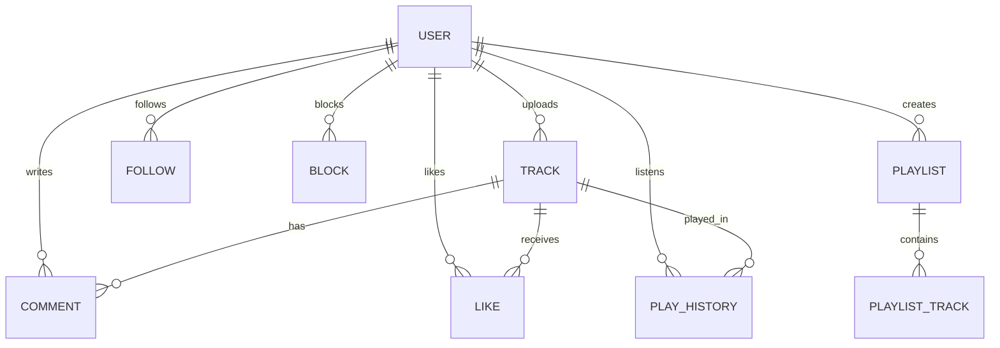

<p align="center">
  
  
  
  
  
</p>

<h1 align="center">🎵 Pulsify — Backend API</h1>

<p align="center">
  <strong>A SoundCloud-inspired audio streaming platform built with a scalable, layered Node.js architecture.</strong>
</p>

<p align="center">
  <a href="https://github.com/Pulsify-dev/Backend">Repository</a> •
  <a href="#-api-modules">API Docs</a> •
  <a href="#-getting-started">Quick Start</a> •
  <a href="#-architecture">Architecture</a>
</p>

---

## 📋 Table of Contents

- [Overview](#-overview)
- [Tech Stack](#-tech-stack)
- [Architecture](#-architecture)
- [Project Structure](#-project-structure)
- [API Modules](#-api-modules)
- [Data Models](#-data-models)
- [Getting Started](#-getting-started)
- [Environment Variables](#-environment-variables)
- [Testing](#-testing)
- [API Documentation](#-api-documentation)

---

## 🔭 Overview

**Pulsify** is a full-featured audio streaming platform that enables users to upload, stream, and share music. The backend provides a RESTful API handling:

- 🔐 **Authentication** — JWT-based auth with email verification, password reset, and token refresh
- 👤 **User Profiles** — Profile management, avatar/cover uploads to S3, search, and privacy controls
- 🌐 **Social Graph** — Follow/unfollow, blocking, mutual followers, relationship status, and user discovery
- 🎵 **Track Management** — Audio upload with metadata extraction, waveform generation, and artwork management
- 🎧 **Playback & Streaming** — Pre-signed URL streaming, play history, and download *(in-progress)*

---

## 🛠 Tech Stack

| Layer | Technology |
|-------|-----------|
| **Runtime** | Node.js (ES Modules) |
| **Framework** | Express 5 |
| **Database** | MongoDB via Mongoose 9 |
| **File Storage** | AWS S3 (`@aws-sdk/client-s3`) |
| **Streaming** | Pre-signed URLs (`@aws-sdk/s3-request-presigner`) |
| **Auth** | JWT (`jsonwebtoken`) + bcrypt |
| **File Upload** | Multer (memory storage) |
| **Audio Processing** | `music-metadata` + `fluent-ffmpeg` |
| **Validation** | Joi |
| **Testing** | Mocha + Chai + Sinon + c8 |
| **Containerization** | Docker |

---

## 🏗 Architecture

Pulsify follows a **strict layered architecture** with clear separation of concerns. Each layer only communicates with the layer directly below it:

```
┌─────────────────────────────────────────────────────────┐
│                      CLIENT                             │
└─────────────────────┬───────────────────────────────────┘
                      │ HTTP
┌─────────────────────▼───────────────────────────────────┐
│                    ROUTES                                │
│         Route definitions + middleware wiring             │
├─────────────────────┬───────────────────────────────────┤
│                 MIDDLEWARE                                │
│    Auth │ Validation │ Upload │ Pagination │ Error        │
├─────────────────────┬───────────────────────────────────┤
│                CONTROLLERS                               │
│      Parse request → Call service → Send response         │
├─────────────────────┬───────────────────────────────────┤
│                 SERVICES                                 │
│     Business logic, validation rules, orchestration       │
├─────────────────────┬───────────────────────────────────┤
│               REPOSITORIES                               │
│          Database queries (Mongoose operations)           │
├─────────────────────┬───────────────────────────────────┤
│                  MODELS                                  │
│         Mongoose schemas, indexes, hooks                  │
├─────────────────────┬───────────────────────────────────┤
│               UTILITIES                                  │
│     S3 │ JWT │ Audio │ Photo │ Errors │ Email             │
└─────────────────────┴───────────────────────────────────┘
```

### Layer Responsibilities

| Layer | Responsibility | Example |
|-------|---------------|---------|
| **Routes** | Map HTTP methods/paths to controllers, attach middleware | `router.post("/tracks", authMiddleware, uploadMiddleware, trackController.createTrack)` |
| **Middleware** | Cross-cutting concerns: auth, validation, file parsing, pagination | `auth.middleware.js`, `upload.middleware.js` |
| **Controllers** | Parse `req` params/body → delegate to service → format `res` | Thin — no business logic |
| **Services** | All business logic: validation rules, S3 orchestration, data transformation | Track upload flow, password hashing, email change flow |
| **Repositories** | Database abstraction — CRUD operations on models | `findById()`, `createTrack()`, `searchUsers()` |
| **Models** | Mongoose schemas with field types, defaults, indexes, and hooks | `track.model.js`, `user.model.js` |
| **Utilities** | Reusable helpers shared across layers | S3 upload/delete/presign, JWT sign/verify, audio metadata |

---

## 📁 Project Structure

```
Backend/
├── server.js                    # Entry point — connects DB, starts Express
├── Dockerfile                   # Container configuration
├── package.json
│
├── src/
│   ├── app.js                   # Express app setup + middleware + route mounting
│   │
│   ├── config/                  # Database & environment configuration
│   │
│   ├── models/                  # Mongoose schemas (18 models)
│   │   ├── user.model.js
│   │   ├── track.model.js
│   │   ├── follow.model.js
│   │   ├── block.model.js
│   │   ├── play-history.model.js
│   │   ├── playlist.model.js
│   │   ├── comment.model.js
│   │   ├── like.model.js
│   │   └── ...
│   │
│   ├── repositories/            # Data access layer
│   │   ├── user.repository.js
│   │   ├── track.repository.js
│   │   ├── follow.repository.js
│   │   └── block.repository.js
│   │
│   ├── services/                # Business logic layer
│   │   ├── auth.service.js
│   │   ├── profile.service.js
│   │   ├── social.service.js
│   │   ├── track.service.js
│   │   ├── email.service.js
│   │   └── captcha.service.js
│   │
│   ├── controllers/             # Request/response handlers
│   │   ├── auth.controller.js
│   │   ├── profile.controller.js
│   │   ├── social.controller.js
│   │   └── track.controller.js
│   │
│   ├── routes/                  # Route definitions
│   │   ├── auth.routes.js
│   │   ├── profile.routes.js
│   │   ├── social.routes.js
│   │   └── track.routes.js
│   │
│   ├── middleware/              # Express middleware
│   │   ├── auth.middleware.js
│   │   ├── error.middleware.js
│   │   ├── upload.middleware.js
│   │   ├── validation.middleware.js
│   │   ├── pagination.middleware.js
│   │   └── admin.middleware.js
│   │
│   ├── utils/                   # Shared utilities
│   │   ├── s3.utils.js          # Upload, delete, pre-signed URLs
│   │   ├── jwt.utils.js         # Token generation & verification
│   │   ├── audio.utils.js       # Metadata extraction & waveform
│   │   ├── photo.utils.js       # Image validation
│   │   └── errors.utils.js      # Custom error classes
│   │
│   └── tests/                   # Unit tests
│
├── Local_Postman/               # API documentation (Postman collections)
│   └── PH2 Doucumentation/
│       ├── Auth_Module.postman_collection.json
│       ├── Users_Module.postman_collection.json
│       ├── Social_Module.postman_collection.json
│       └── Tracks_Module.postman_collection.json
│
├── ReqDocs/                     # Requirements & specifications
│   ├── Pulsify_API.TXT          # Full API specification
│   └── schema.txt               # Database schema design
│
└── seed/                        # Database seeding scripts
```

---

## 🔌 API Modules

### Module 1 — 🔐 Authentication (`/auth`)
| # | Method | Endpoint | Auth | Description |
|---|--------|----------|------|-------------|
| 1 | POST | `/auth/register` | ❌ | Create account + email verification |
| 2 | POST | `/auth/login` | ❌ | Get access + refresh tokens |
| 3 | POST | `/auth/verify-email` | ❌ | Verify email via JWT token |
| 4 | POST | `/auth/refresh` | ❌ | Rotate token pair |
| 5 | POST | `/auth/forgot-password` | ❌ | Send reset email |
| 6 | POST | `/auth/reset-password` | ❌ | Apply new password |
| 7 | POST | `/auth/logout` | ✅ | Invalidate refresh token |

### Module 2 — 👤 User Profiles (`/users`)
| # | Method | Endpoint | Auth | Description |
|---|--------|----------|------|-------------|
| 1 | GET | `/users/me` | ✅ | Get own full profile |
| 2 | PATCH | `/users/me` | ✅ | Update profile fields |
| 3 | DELETE | `/users/me` | ✅ | Permanently delete account |
| 4 | POST | `/users/me/avatar` | ✅ | Upload avatar (5MB max) |
| 5 | POST | `/users/me/cover` | ✅ | Upload cover photo (10MB max) |
| 6 | PUT | `/users/me/email` | ✅ | Initiate email change |
| 7 | PUT | `/users/me/password` | ✅ | Change password |
| 8 | GET | `/users/confirm-email-change` | ❌ | Confirm email change via token |
| 9 | GET | `/users` | ❌ | Search users |
| 10 | GET | `/users/:user_id` | ⚪ | Get public profile |

### Module 3 — 🌐 Social & Interactions (`/users`)
| # | Method | Endpoint | Auth | Description |
|---|--------|----------|------|-------------|
| 1 | GET | `/users/me/suggested` | ✅ | Suggested users to follow |
| 2 | GET | `/users/me/blocked` | ✅ | Blocked users list |
| 3 | GET | `/users/me/blockers` | ✅ | Users who blocked you |
| 4 | POST | `/users/:user_id/follow` | ✅ | Follow a user |
| 5 | DELETE | `/users/:user_id/follow` | ✅ | Unfollow a user |
| 6 | GET | `/users/:user_id/followers` | ❌ | Follower list (paginated) |
| 7 | GET | `/users/:user_id/following` | ❌ | Following list (paginated) |
| 8 | GET | `/users/:user_id/relationship` | ✅ | Full relationship status |
| 9 | GET | `/users/:user_id/mutual-followers` | ✅ | Mutual followers |
| 10 | POST | `/users/:user_id/block` | ✅ | Block user |
| 11 | DELETE | `/users/:user_id/block` | ✅ | Unblock user |
| 12 | PATCH | `/users/:user_id/block` | ✅ | Update block reason |
| 13 | GET | `/users/:user_id/social-counts` | ❌ | Social counters |

### Module 4 — 🎵 Tracks
| # | Method | Endpoint | Auth | Description |
|---|--------|----------|------|-------------|
| 1 | POST | `/tracks` | ✅ | Upload track + artwork |
| 2 | GET | `/tracks/:id` | ⚪ | Get track by ID |
| 3 | PATCH | `/tracks/:id` | ✅ | Update metadata |
| 4 | DELETE | `/tracks/:id` | ✅ | Delete track + S3 files |
| 5 | GET | `/tracks/:id/status` | ✅ | Poll transcoding status |
| 6 | GET | `/tracks/:id/waveform` | ❌ | Get waveform peaks |
| 7 | PUT | `/tracks/:id/artwork` | ✅ | Replace cover artwork |
| 8 | GET | `/artists/:id/tracks` | ❌ | Artist's public tracks |

> ✅ = Required &nbsp; ⚪ = Optional &nbsp; ❌ = Not required

---

## 📊 Data Models

The database uses **18 Mongoose models** with the following core relationships:



### Key Models

| Model | Purpose | Key Fields |
|-------|---------|------------|
| `User` | Account & profile | `username`, `email`, `tier`, `avatar_url`, `is_verified`, `is_suspended` |
| `Track` | Audio content | `artist_id`, `audio_url`, `artwork_url`, `duration`, `waveform`, `playback_state` |
| `Follow` | Social graph edges | `follower_id`, `following_id` |
| `Block` | Block relationships | `blocker_id`, `blocked_id`, `reason` |
| `PlayHistory` | Listening records | `user_id`, `track_id`, `duration_played_ms`, `is_completed` |

---

## 🚀 Getting Started

### Prerequisites

- **Node.js** ≥ 18
- **MongoDB** (local or Atlas)
- **AWS S3 Bucket** (for file storage)
- **FFmpeg** (for audio processing)

### Installation

```bash
# Clone the repository
git clone https://github.com/Pulsify-dev/Backend.git
cd Backend

# Install dependencies
npm install

# Set up environment variables
cp .env.example .env
# Edit .env with your credentials (see below)

# Start development server
npm run dev
```

### Docker

```bash
docker build -t pulsify-backend .
docker run -p 3000:3000 --env-file .env pulsify-backend
```

---

## 🔑 Environment Variables

Create a `.env` file in the project root:

```env
# Server
PORT=3000

# MongoDB
MONGO_URI=mongodb+srv://<user>:<pass>@cluster.mongodb.net/pulsify

# JWT
JWT_SECRET=your-jwt-secret
JWT_REFRESH_SECRET=your-refresh-secret

# AWS S3
AWS_S3_BUCKET=your-bucket-name
AWS_REGION=us-east-1
AWS_ACCESS_KEY_ID=your-access-key
AWS_SECRET_ACCESS_KEY=your-secret-key

# Email (SMTP)
EMAIL_HOST=smtp.example.com
EMAIL_USER=noreply@pulsify.com
EMAIL_PASS=your-email-password

# Captcha
CAPTCHA_SECRET_KEY=your-captcha-secret
```

### S3 Bucket Structure

```
your-bucket/
├── tracks/
│   ├── audio/          ← MP3, WAV, FLAC, AAC files
│   └── artwork/        ← Track cover art
└── users/
    ├── avatars/        ← Profile pictures
    └── covers/         ← Cover banners
```

---

## 🧪 Testing

```bash
# Run all unit tests with coverage
npm test

# Coverage reports are generated in /coverage
```

Tests use **Mocha** as the runner, **Chai** for assertions, **Sinon** for mocking, and **c8** for code coverage.

---

## 📖 API Documentation

Complete Postman collections with request/response examples for every endpoint are located in:

```
Local_Postman/PH2 Doucumentation/
├── Auth_Module.postman_collection.json       # 7 endpoints
├── Users_Module.postman_collection.json      # 10 endpoints
├── Social_Module.postman_collection.json     # 13 endpoints
└── Tracks_Module.postman_collection.json     # 8 endpoints
```

Import any file into **Postman** → Set `{{baseUrl}}` and `{{accessToken}}` variables → Start testing.

---

<p align="center">
  Made with ❤️ by the <strong>Pulsify</strong> team
</p>
